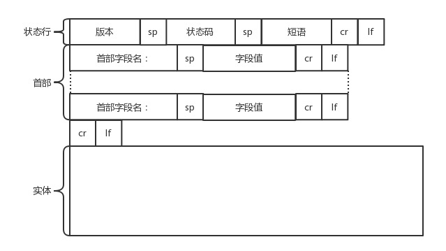

## HTTP:超文本传输协议，协议 固定的格式

    输入url -> 看到页面
    GET www.baidu.com HTTP/1.1
    user-agent:XXXX IE/chrome

    上面这个格式放到传输层(TCP,http是基于TCP的,另外一个叫UDP)去

    拿到响应
    HTTP/1.1 200 ok
    content-type:text/html image.png
    key:value

    <doctype html>
    <html>
    <body>
    百度一下
    </body>
    </html>